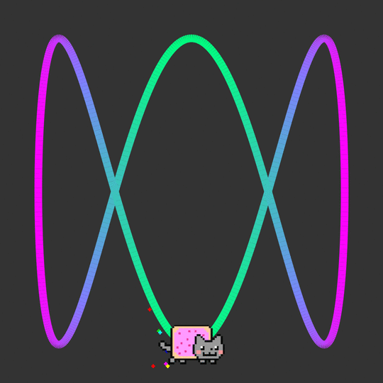

Jules Antoine Lissajous was a French physicist who lived from 1822 to 1880.
Like many physicists of his time, Lissajous was interested in being able to see
vibrations. He started off standing tuning forks in water and watching the
ripple patterns, but his most famous experiments involved tuning forks and
mirrors. For example, by attaching a mirror to a tuning fork and shining
a light onto it, Lissajous was able to observe, via another couple of mirrors,
the reflected light twisting and turning on the screen in time to the
vibrations of the tuning fork. When he set up two tuning forks at right angles,
with one vibrating at twice the frequency of the other, Lissajous found that
the curved lines on the screen would combine to make a figure of eight pattern.

The Australian Broadcat Corporation (ABC) logo is a 3:1 Lissajous figure, if Lissajous wanted
to see this pattern he would have to get one of his tuning forks to vibrate
three times faster than the other.

Why did the ABC choose a Lissajous figure for its logo? 

The ABC is both a radio network and a television network. Before the days
of electronic frequency counters, broadcast engineers often used Lissajous
patterns to help tune equipment. A Lissajous pattern seemed a good motif,
common to both radio and television.

Because the ABC broadcat in both radio and television, it seemed like 2:1
would be a good ratio. (This makes an infinity symbol or a figure of eight
lying on its side). But back in 1965, the figure of 8 logo was being used by
the University of the Air. So the ABC decided to base their logo a 3:1 ratio.

The ABC logo is a trademark of the Australian Broadcat Corporation.
